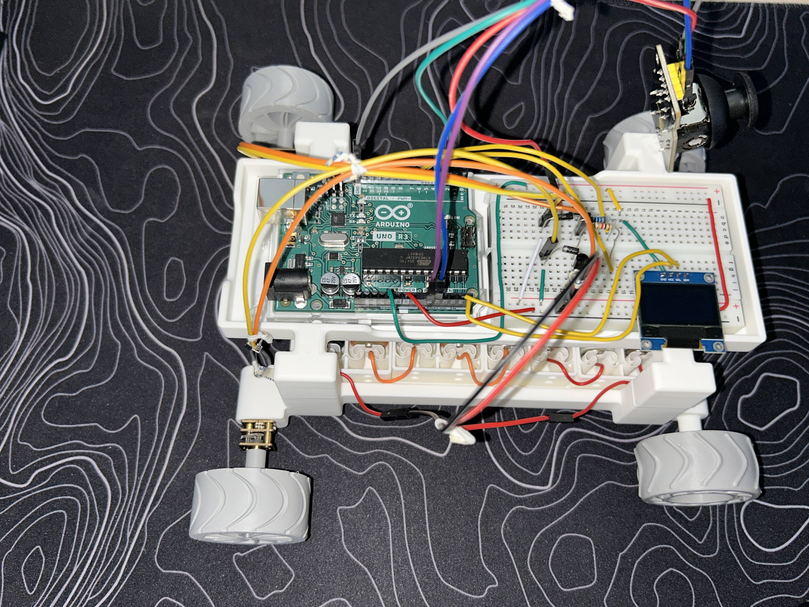
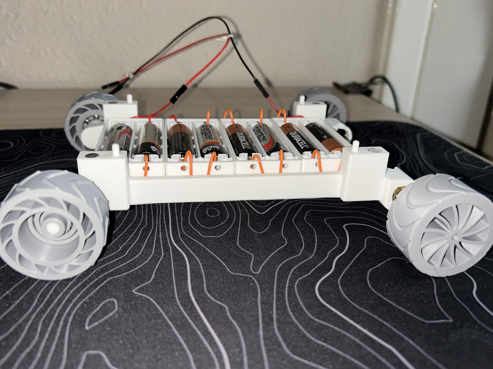
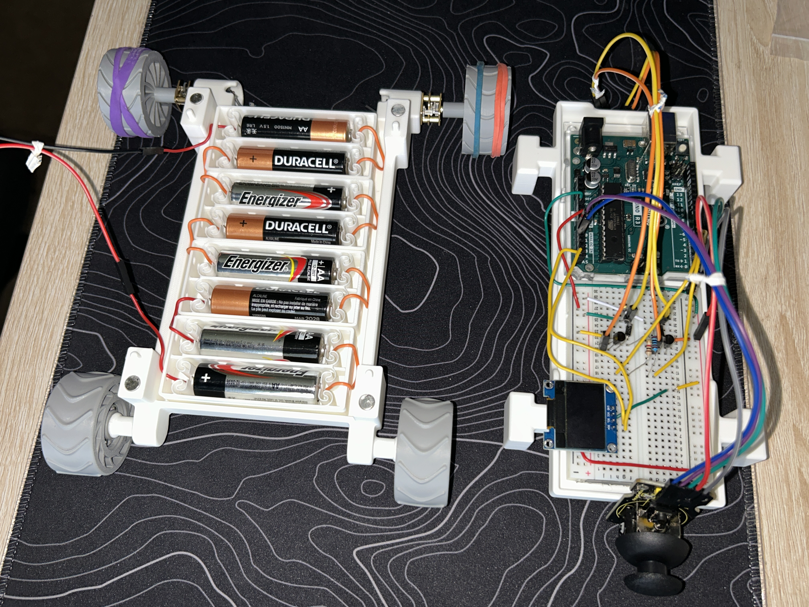
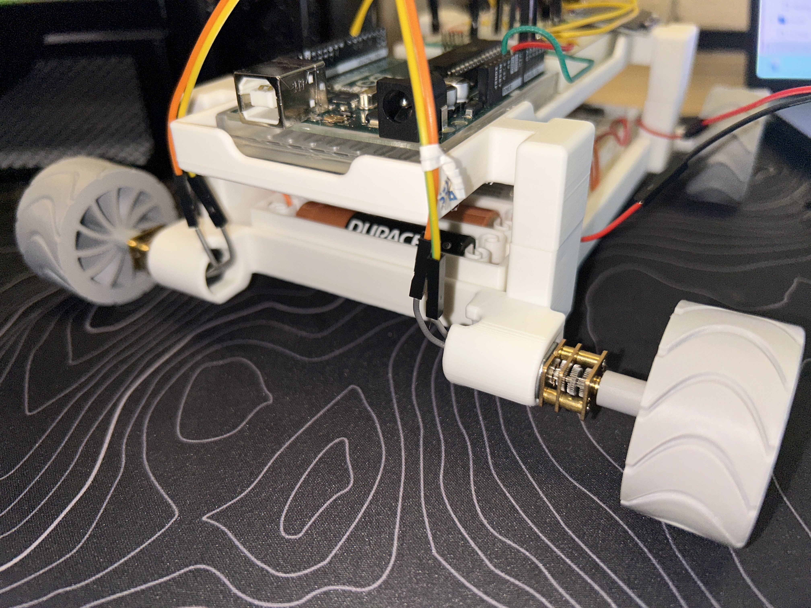
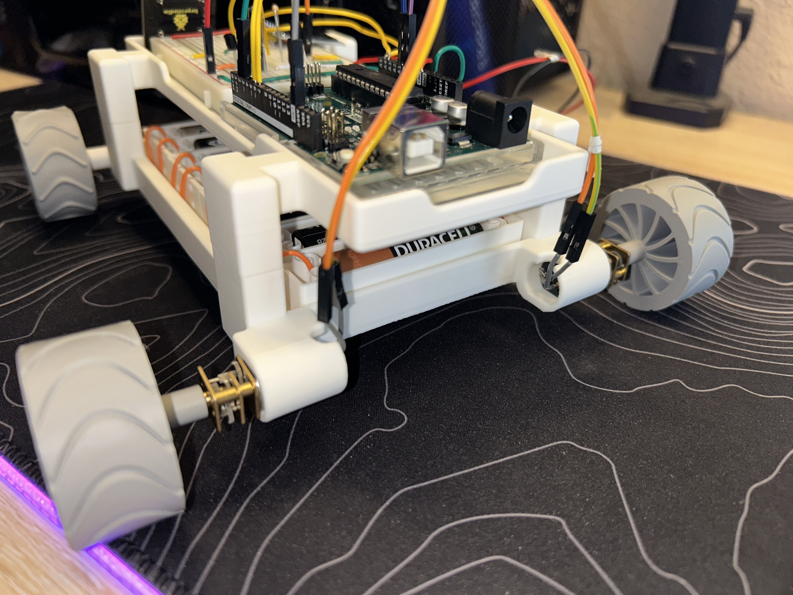
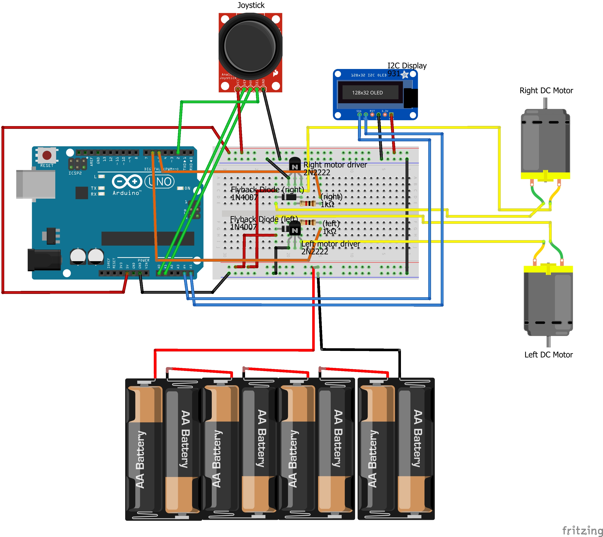

# Differential-Drive-Arduino-Rover
Custom differential-drive rover featuring a fully 3D printed chassis, PWM motor control, joystick steering, and live OLED telemetry using Arduino.

---

## Project Overview

This project is a custom-built Arduino rover platform designed and fabricated from the ground up using Fusion 360, embedded motor control, and additive manufacturing techniques.

The rover uses a differential steering drivetrain powered by dual DC gear motors controlled through PWM transistor stages. Real-time telemetry is displayed through an onboard I2C OLED display while joystick input provides proportional throttle and steering control.

The project combines:

- Mechanical CAD design
- 3D printing
- Embedded systems
- Power electronics
- Differential drive control
- Real-time telemetry systems
  
---

## Features 

- Fully custom 3D printed chassis and drivetrain
- Differential steering control
- Dual PWM-controlled DC motors
- Analog joystick input system
- Live OLED telemetry display
- Custom Fusion 360 wheel and tread design
- Modular upper electronics tray
- Embedded Arduino firmware
- Real-time motor output calculations

---

## Media Section

### Final Rover Assembly

### OLED Telemetry

### Drivetrain Closeup

---

## CAD Design Section

All mechanical components were designed in Autodesk Fusion 360.

Key design objectives included:

- Modular assembly
- Compact drivetrain packaging
- Easy battery integration
- Printable geometry optimization
- Lightweight wheel construction
- Integrated wiring/electronics tray

### Fusion 360 Renders

---

## Electronics Architecture

- The rover uses differential steering driven by two independently PWM-controlled DC motors. Each motor is switched using a dedicated 2N2222 transistor stage with flyback diode protection. A joystick module provides analog steering/throttle input while an SSD1306 I2C OLED provides live telemetry feedback.

- The rover uses a dual-motor PWM drivetrain architecture controlled through an Arduino UNO.

Each motor is independently driven through a dedicated 2N2222 transistor stage with flyback diode protection.

### System Components

- Arduino UNO
- 2x 12V DC gear motors
- 2x 2N2222 NPN transistors
- 2x flyback diodes
- SSD1306 I2C OLED display
- Analog joystick module
- 8x AA battery pack

### Wiring Diagram

---

## Firmware Features

The firmware implements:

- Analog joystick processing
- Differential steering calculations
- PWM motor control
- OLED telemetry output
- Deadzone filtering
- Real-time motor percentage calculations

### Telemetry Output

Current telemetry includes:

- Throttle %
- Steering bias %
- Left motor output %
- Right motor output %

---

## Challenges & Limitations

Several engineering and fabrication challenges were encountered during development:

### Wheel Traction

Initial PLA wheel prototypes provided insufficient traction on smooth surfaces. Removable rubber traction bands were later added to the driven wheels to improve drivetrain grip and vehicle stability.

### 3D Printing Support Failures

Large chassis overhangs initially caused support instability and print separation issues. Print orientation, support interface settings, and cooling parameters were iteratively adjusted to improve reliability.

### Fusion 360 Assembly References

Assembly reference and context-linking issues occasionally caused export failures and broken dependencies between components. Workflow adjustments and isolated exports were used to stabilize the design pipeline.

### OLED Debugging

I2C display initialization and address conflicts required multiple rounds of firmware debugging and wiring verification before successful telemetry integration.

---

## Future Improvements 

Planned future upgrades include:

- H-bridge motor drivers
- MOSFET-based power stages
- Bidirectional motor control
- ESP32 wireless control
- Battery voltage monitoring
- Wheel encoders
- Closed-loop speed control
- Suspension system
- Custom PCB integration
